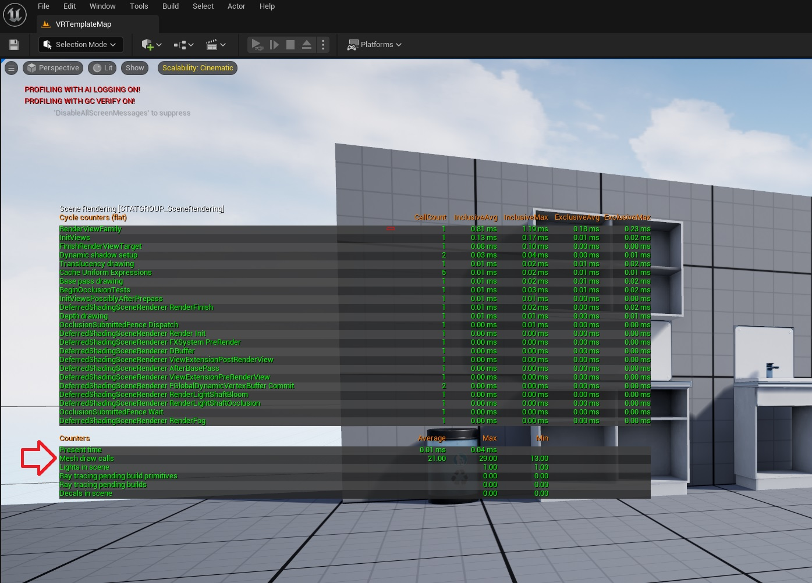

# Notes on VR Performance
Performance is crucial for developing high-quality VR content, as it helps prevent user discomfort, motion sickness, and enhances realism. Ensuring smooth operation and prioritizing optimal frame rates are essential aspects of VR development that are often overlooked. Inadequate frame rates or inconsistent frame times can result in subpar user experiences and contribute to motion sickness. <br />

Crafting high-performance content is no easy task, PCVR (powerful gaming PCs) and standalone VR (modest mobile headsets) demand different approaches. These notes focus on standalone optimisation, specifically for the Oculus Quest ecosystem. Note, different headsets carry unique requirements. Performance hinges on numerous factors: the need for high resolutions, double frames, power constraints, limited processing, rendering power, and the weight of thermal throttling. <br />

Extended build times can hinder productivity. Despite its distinct challenges, VR development benefits from numerous performance-enhancing solutions that are commonly employed in the flat game world. <br />

## When to Optimise?
* Optimise from the beginning!
* Be performance conscious during development - think about scene complexity, do I need to add this in? is it worth the performance hit?
* A good time to optimise is when you are not hitting the desired frame rate.
* Some features look amazing, but are they worth it? (each frame has a budget)
* At the time of writing standalone VR is very very performance limited.  
## Frame Rate Vs Frame Time
* **Frame rate** is the number of frames displayed per second (FPS). It is calculated by dividing the total number of frames displayed by the total amount of time taken to display them. <br />
* **Frame time** is calculated by dividing the total time it takes to render a frame by the number of frames rendered. It is typically measured in milliseconds (ms). <br />
* Let's say a game runs at 60 frames per second (fps), taking 16.67 milliseconds to render each frame.  The frame time is 16.67 milliseconds per frame. This is also known as the frame budget. Here we have a frame budget of 16.67 ms for both the CPU and GPU. It's super easy to spend your frame budget on a standalone headset (start thinking of other variables like thermal throttling). <br />
   <br />
   | Frame Rate (FPS) | Frame Time (ms) |
   |------------------|-----------------|
   |30|33.3|
   |60|16.67|
   |90|8.3|
* Frame time is a better measure of performance than frame rate because it takes into account the consistency of the frame rate. A high frame rate does not necessarily mean that the game will be smooth, if the frame time is inconsistent. For example, a game may have a frame rate of 60fps, but if the frame time varies from 16ms to 33ms, the game will not be smooth. <br />
* Frame time is useful for diagnosing performance issues. If you are experiencing stuttering or other performance problems, you can use frame time to identify the source of the problem. <br />
* Headsets have different required frame rates. When the frame rates drop, it's likely to cause disorientation and nausea for the user. Maintaining a minimum frame rate (reducing frame times) can be particularly challenging on a standalone headset. <br />
* Most PCVR runs at 90fps. Standalone is usually 72fps (but can be as high as 120fps). <br />
  <br />
  | Headset | Frame Rate |
  |---------|--------------------------------|
  |HTC Vive|90|
  |Quest 1 |72|
  |Quest 2 |upto 120|
  |Quest Pro|90|
  |Valve Index|upto 144|
## Profiling
* Profiling tools can help identify where a game or application is experiencing slow performance by highlighting the frame times that are taking longer to render. There are a variety of profiling solutions available to choose from. Personally, as someone who develops using Unreal Engine (UE) with a Quest headset, I prefer to use RenderDoc and UE's built-in performance suite, Unreal Insights. <br />
* Profiling performance reveals many reasons for increased frame times, which can be classified into two categories: CPU-bound or GPU-bound. <br />
   ### Profiling Tools (lots of options - but can be dependent on headset and graphic chipset)
   [🆓⚒️ Oculus Debug Tool](https://developer.oculus.com/documentation/native/pc/dg-debug-tool/?locale=en_GB) <br />
   [🆓⚒️ RenderDoc](https://renderdoc.org/) <br />
   [🆓⚒️ OVR Metrics Tools](https://developer.oculus.com/downloads/package/ovr-metrics-tool/) <br />
   [🆓⚒️ Android GPU Inspector (AGI) - for Android based HMDs](https://developer.android.com/agi) <br />
   [🆓⚒️ ARM: Streamline Performance Analyzer](https://developer.arm.com/Tools%20and%20Software/Streamline%20Performance%20Analyzer) <br />
   [🆓⚒️ SteamVR Frame Timing](https://developer.valvesoftware.com/wiki/SteamVR/Frame_Timing) <br />
   [🆓⚒️ NVIDIA Visual Profiler](https://developer.nvidia.com/nvidia-visual-profiler) <br />
   [🆓⚒️ NVIDIA Nsight Graphics](https://developer.nvidia.com/nsight-graphics) <br />
   [🆓⚒️ NVIDIA VR Capture & Replay - Early Access](https://developer.nvidia.com/vcr-early-access) <br />
   [🆓⚒️ NVIDIA Performance Analysis Tools](https://developer.nvidia.com/performance-analysis-tools) <br />
   [🆓⚒️ AMD Radeon GPU Profiler](https://gpuopen.com/rgp/) <br />
   [🆓⚒️ Intel® Graphics Performance Analyzers:](https://www.intel.com/content/www/us/en/developer/tools/graphics-performance-analyzers/overview.html) <br />
   [🆓⚒️ Intel® VTune™ Profiler](https://www.intel.com/content/www/us/en/developer/tools/oneapi/vtune-profiler.html#gs.qs0mup) <br />
   [🆓⚒️ PVRTune](https://developer.imaginationtech.com/pvrtune/) <br />
   [⚒️ Superluminal](https://superluminal.eu/) <br />

⭐ [See my resourses on performance](https://github.com/authorTom/ultimate-XR-dev-guide/blob/main/README.md#performance-and-benchmarking)
<br />
### CPU or GPU Bound?
The first questions to ask yourself; Whats causing the problem? is it CPU or GPU bound? <br />

**CPU Bound** <br />
Performance primarily limited by the CPU's processing power can be caused by: <br />
* AI/physics calculations
* Animation/character controller logic
* Collision detection
* Level/asset streaming

A straightforward method to assess this is by temporarily disabling the rendering process, which eliminates the cost of the render pipeline. Monitor the application's framerate and the time taken to complete each frame in milliseconds. If performance remains unchanged, it is likely that the issue is CPU-bound. However, if performance is significantly impacted, the GPU is likely the cause. <br />
<br />
[Getting started with Unreal Insights (UE5)](https://docs.unrealengine.com/5.0/en-US/trace-in-unreal-engine-5/)

**GPU Bound** <br />
Performance limited by the GPU's rendering capabilities can be caused by: <br />
* Scene complexity (vertex)
* Shader complexity (fragment)
* Texture quality/resolution
* Particle effects

To determine whether the performance issue stems from a vertex or fragment-related problem, attempt rendering fewer pixels by setting the render scale to 0.01. This approach will reduce the number of fragments rendered while maintaining the complexity. <br />
```
vr.PixelDensity 0.01
```
Common causes of vertex bound performance <br />
* Culling objects are taking too long
* Too many draw calls are being issued
* Too many vertices are being rendered

Possible solutions <br />
* Simplify complex geometry
* Reduce draw calls (batching draw calls)
* Implement a Level of Detail (LOD) system

Use a profiler to isolate problems. <br />
Change one thing at a time and re-profile. Test, test and test some more. Making small iterations is a good strategy for identifying problems. <br />
If fragment bound, optimise shaders to address pixel complexity. <br />

## Performance on Standalone VR
When developing for standalone VR get a feel for the numbers and look at headset recommendations and limitations. Recommended draw calls for PCVR is around 1000. <br />

| Platform | Draw Calls | Description |
|-----|-----|-----|
| Quest 1 | 50-150 |Busy Simulation|
| Quest 1 | 150-250 |Medium Simulation|
| Quest 1 | 200-400 |Light Simulation|
| Quest 2 | 80-200 |Busy Simulation|
| Quest 2 | 200-300 |Medium Simulation|
| Quest 2 | 400-600 | Light Simulation|

Both Quest 1 & 2 have a recommended minimum of 72FPS. <br/>

| Platform | Triangle Count |
|-----|-----|
| Quest 1 | 350k-500k |
| Quest 2 | 750k-1M |

Data taken from [Meta](https://developer.oculus.com/documentation/unreal/unreal-debug-android/)
<br />
## Useful profiling commands (Unreal Engine)
| Command | Function |
|-----|-----| 
| Stat Unit | Displays performance information for the project's frame, game, draw, GPU, RHIT, and DynRes threads |
| Stat FPS | Displays frames per second and average frame time |
| Stat RHI | Displays RHI memory and performance statistics)
| Stat SceneRendering | Displays general rendering statistics. This is a good starting point to find general areas of slow performance in the rendering process |
| Stat GPU | Displays GPU statistics for the frame |
<br />

## Scene and VR Project Settings Within Unreal Engine 
```
Project Settings > Engine > Rendering > VR

Dynamic Fixed Foveation (enable)
Instanced stereo (enable)
Mobile Multiview (enable)
Round Robin Occlusion Queries (enable)
```
<br />
Mobile HDR allows for post processing in a standalone headset but can be very expensive and not all headsets support this. Round Robin Occlusion (RRO) improves VR performance by alternating rendering occlusion between one eye each frame instead of both, at the cost of a single frame of latency. To optimise stereo rendering on the CPU, use instanced stereo for desktop and mobile multiview for mobile. <br />

## Tip 1 - Reduce Draw Calls
* A draw call is a command to the GPU, instructing it to render a specific set of graphical elements, such as textures or polygons.
* GPU handles most graphics computations, but CPU controls it.
* Too many draw calls can bottleneck performance.
* Batching combines calls for identical meshes and parameters.
* Static batching is effective for unchanging, static scene parts.
* Unity engine uses static batching; can affect culling negatively if overused.
* Unreal Engine sorts objects by mesh and shader parameters for more flexibility.
* Effectiveness depends on unique meshes and materials in scene.
* Having modular environment art reduces draw calls.
* Less is better. Thresholds are dependent on headset specifications. 
* For Quest 2 some recommend targeting draw calls <100 per frame.

```
Quick Tip: Unreal Engine - to check draw call counts in the editor run the "stat SceneRendering" command.
```

#### Solution - Batching draw calls
   * Static batching
   * Dynamic batching
#### Solution - GPU instancing
* GPU instancing is an extreme form of batching.
* Single mesh loaded, multiple copies stamped.
* Minimal CPU overhead.
* Limitations:
   * Position, rotation, scale can change.
   * Same material/properties for all instances.
   * Specifics can depend on the engine.

<br />

## Tip 2 - Textures & Materials
## Tip 3 - Lighting
## Tip 4 - Transparency & Blending
## Tip 5 - Shaders
## Tip 6 - Antialiasing
## Tip 7 - Occlusion culling
## Tip 8 - Fixed Foveated Rendering
## Resources
[➡️ My list of XR performance resources](https://github.com/authorTom/ultimate-XR-dev-guide#performance-and-benchmarking)
## Issues
This project is actively maintained, please raise an issue if you feel the need to. <br />
<br />
**Like what has been done? please give the repository a star ⭐** <br />
## My Other Projects
[➡️ The Ultimate XR Developers Resource Guide](https://github.com/authorTom/ultimate-XR-dev-guide)
